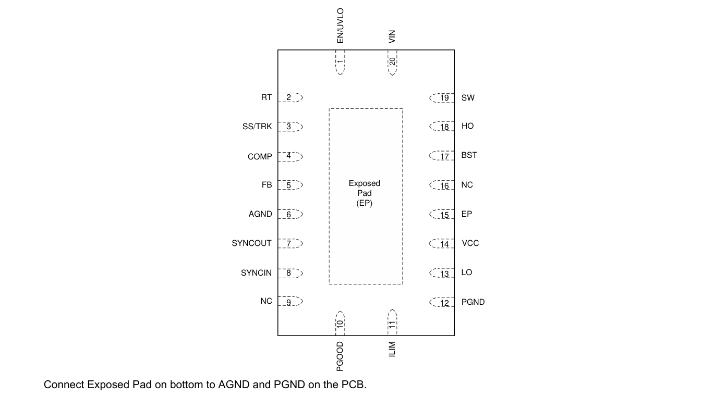
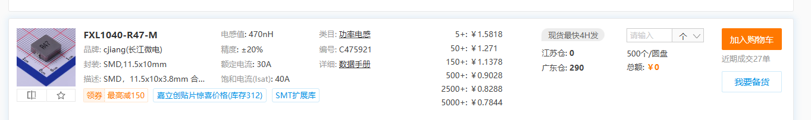
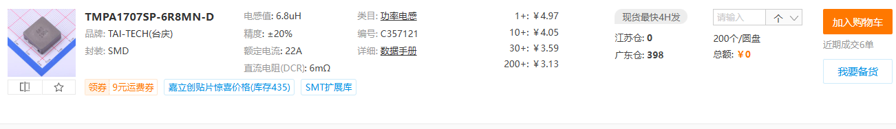
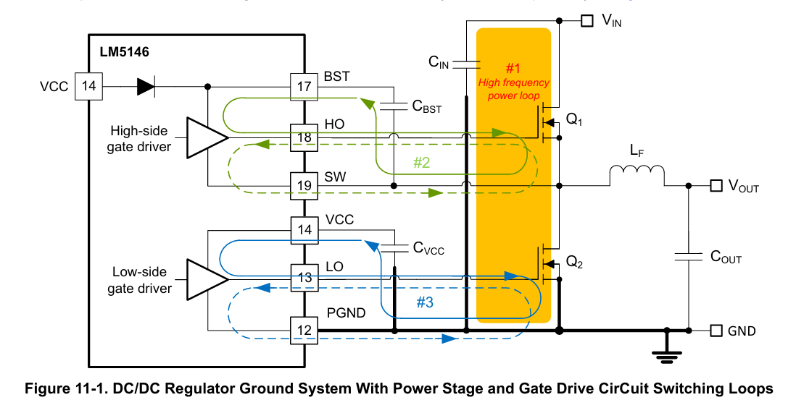

# 设计指引

## 1 特性

 • 功能安全能力 - 提供文档以辅助功能安全系统设计
 • 多用途同步降压 DC/DC 控制器 - 输入电压范围宽，5.5 V 至 100 V - 最大结温 150°C - 反馈精度为 ±1% 的 0.8 V 基准电压 - 输出电压可调，范围从 0.8 V 到 60 V - 高 VIN/VOUT 比下的最小导通时间 40 ns - 低 dropout 下的最小关断时间 140 ns - 无损耗 RDS(on) 或分流电流检测 - 优化以满足 CISPR 11 和 CISPR 32 B 类 EMI 要求
 • 开关频率从 100 kHz 到 1 MHz - 支持 SYNC 输入和 SYNC 输出 - 可选择二极管仿真或 FPWM 模式
 • 标准 VTH MOSFET 的 7.5 V 栅极驱动器 - 14 ns 自适应死区时间控制 - 2.3 A 源能力和 3.5 A 汲入能力
 • 快速线路和负载瞬态响应 - 具有线路前馈的电压模式控制 - 高增益带宽误差放大器
 • 内置保护特性以实现稳健设计 - 可调输出电压软启动 - 过流保护，采用 hiccup 模式 - 带迟滞的输入欠压锁定 (UVLO) - VCC 和栅极驱动 UVLO 保护 - 精确使能输入和开漏 PGOOD 指示灯，用于排序和控制 - 带迟滞的热关断保护
 • 带可焊侧翼的 20 引脚 VQFN 封装
 • 使用 LM5146 和 WEBENCH® Power Designer 创建自定义设计

## 2 引脚

将底部的暴露焊盘连接到 PCB 上的 AGND 和 PGND。

| 引脚编号 | 名称    | 输入/输出 | 描述                                                                                                                                                                                                                                                                                                                                                                                                                                                                                                                                                                                                            |
| -------- | ------- | --------- | --------------------------------------------------------------------------------------------------------------------------------------------------------------------------------------------------------------------------------------------------------------------------------------------------------------------------------------------------------------------------------------------------------------------------------------------------------------------------------------------------------------------------------------------------------------------------------------------------------------- |
| 1        | EN/UVLO | 输入      | 启用输入和欠压锁定编程引脚。当 EN/UVLO 电压低于 0.4 V 时，控制器处于关闭模式，所有功能均被禁用。当 EN/UVLO 电压大于 0.4 V 且小于 1.2 V 时，调节器处于待机模式，VCC 稳压器工作，SS 引脚接地，HO 和 LO 输出无开关。当 EN/UVLO 电压高于 1.2 V 时，SS/TRK 电压可以斜坡上升，脉宽调制的门驱动信号传递到 HO 和 LO 引脚。当 EN/UVLO 超过 1.2 V 时，一个 10-uA 电流源被启用并通过外部 UVLO 分压电阻流动，以提供滞后。可以通过调整外部分压电阻的阻值来调整滞后。                                                                                                                                                         |
| 2        | RT      | 输入      | 振荡器频率调整引脚。内部振荡器通过 RT 和 AGND 之间的单个电阻器进行编程。TI 建议振荡器频率最大为 1 MHz。即使使用 SYNCIN 引脚同步到外部时钟，RT 引脚电阻器也是必需的。                                                                                                                                                                                                                                                                                                                                                                                                                                            |
| 3        | SS/TRK  | 输入      | 软启动和电压跟踪引脚。外部电容器和内部 10-uA 电流源设置启动期间误差放大器参考的上升速度。当 SS/TRK 引脚电压小于 0.8 V 时，SS/TRK 电压控制误差放大器的非反向输入。当 SS/TRK 电压超过 0.8 V 时，放大器由内部 0.8 V 基准控制。在待机和故障条件下，SS/TRK 放电至地。启动后，SS/TRK 电压被钳位到比 FB 引脚电压高 115 mV。如果由于负载故障而导致 FB 下降，SS/TRK 会放电至比 FB 高 115 mV 的电平，以便在故障解除时提供受控恢复。可以通过将 0 V 至 0.8 V 之间的低阻抗基准连接到 SS/TRK 引脚来实现电压跟踪。10-uA SS/TRK 充电电流流入基准电压，如果阻抗不低，会产生电压误差。将至少 2.2 nF 的电容连接到 SS/TRK 和 AGND。 |
| 4        | COMP    | 输出      | 内部误差放大器的低阻抗输出。将环路补偿网络连接在 COMP 引脚和 FB 引脚之间。                                                                                                                                                                                                                                                                                                                                                                                                                                                                                                                                      |
| 5        | FB      | 输入      | 内部误差放大器的反相输入的反馈连接。输出电压电平通过从输出到此引脚的电阻分压器设置。FB 引脚的调节阈值通常为 0.8 V。                                                                                                                                                                                                                                                                                                                                                                                                                                                                                             |
| 6        | AGND    | 电源      | 模拟接地。用于内部 0.8 V 电压基准和模拟电路的返回端。                                                                                                                                                                                                                                                                                                                                                                                                                                                                                                                                                           |
| 7        | SYNCOUT | 输出      | 同步输出。逻辑输出，提供与高端 FET 门驱动器相位差 180° 的时钟信号。将主 LM5146 的 SYNCOUT 连接到第二个 LM5146 的 SYNCIN 引脚，以在相同频率下操作两个控制器，并在高端 FET 开关打开时交替 180°。请注意，当控制器从与 RT 电阻器设置的自由运行频率不同的外部时钟工作时，SYNCOUT 引脚不提供 180° 交替。                                                                                                                                                                                                                                                                                                              |
| 8        | SYNCIN  | 输入      | 双功能引脚，用于提供可选的时钟输入并通过低端 MOSFET 启用二极管仿真。将时钟信号连接到 SYNCIN 引脚可将开关同步到外部时钟。当控制器与外部时钟同步时，低端 MOSFET 的二极管仿真被禁用，在轻负载下低端 MOSFET 中可以流动负电流。在 SYNCIN 引脚保持逻辑低电平状态时，二极管仿真启用，以防止电感器中出现反向电流。在轻负载下，二极管仿真导致非连续模式操作 (DCM)，提高了效率。SYNCIN 引脚上的逻辑高电平禁用二极管仿真，产生强制 PWM (FPWM) 操作。在软启动期间，当 SYNCIN 为高或存在时钟信号时，LM5146 在输出稳压之前处于二极管仿真模式，然后逐步增加 SW 零交叉阈值，从而逐步从 DCM 过渡到 FPWM。                        |
| 9        | NC      |           | 无电气连接                                                                                                                                                                                                                                                                                                                                                                                                                                                                                                                                                                                                      |
| 10       | PGOOD   | 输出      | 电源良好指示器。此引脚是开漏输出。高电平状态表明 FB 引脚的电压在以 0.8 V 为中心的指定容差窗口内。                                                                                                                                                                                                                                                                                                                                                                                                                                                                                                               |
| 11       | ILIM    | 输入      | 电流限制调整和电流检测比较器输入。来自 ILIM 引脚的电流通过外部电阻器对谷电流限制的阈值电压进行编程。阈值调整电阻的另一端可以连接到低端 MOSFET 的漏极以进行 RDs(on) 检测，或连接到低端 FET 的源极电流检测电阻器。                                                                                                                                                                                                                                                                                                                                                                                                |
| 12       | PGND    | 电源      | 低端 MOSFET 门驱动器的电源接地返回引脚。直接连接到低端 MOSFET 的源极或分流电阻的接地端。                                                                                                                                                                                                                                                                                                                                                                                                                                                                                                                        |
| 13       | LO      | 电源      | 低端 MOSFET 门驱动器输出。通过短的低电感路径连接到低端同步整流器 FET 的门极。                                                                                                                                                                                                                                                                                                                                                                                                                                                                                                                                   |
| 14       | VCC     | 输出      | 7.5 V 偏置稳压器的输出。使用位于控制器附近的低 ESR/ESL 电容器将其局部去耦至 PGND。控制器偏置可以由比内部 VCC 稳压电压更高的外部电源供电。使用外部偏置时请小心，确保施加的电压不高于最低 VIN 电压，并且不超过 VCC 引脚的最大工作额定值。请参阅推荐的操作条件。                                                                                                                                                                                                                                                                                                                                                   |
| 15       | EP      |           | 引脚内部连接到封装的暴露焊盘。连接到暴露焊盘上的接地以提高散热。                                                                                                                                                                                                                                                                                                                                                                                                                                                                                                                                                |
| 16       | NC      |           | 无电气连接                                                                                                                                                                                                                                                                                                                                                                                                                                                                                                                                                                                                      |
| 17       | BST     | 输出      | 高端门驱动器的自举电源。连接到自举（启动）电容器。自举电容器为高端 FET 门供电，必须尽可能靠近控制器放置。如果使用外部自举二极管以减少给自举电容器充电所需的时间，则将二极管的阴极连接到 BST 引脚，阳极连接到 VCC。                                                                                                                                                                                                                                                                                                                                                                                              |
| 18       | HO      | 电源      | 高端 MOSFET 门驱动器输出。通过短的低电感路径连接到高端 MOSFET 的门极。                                                                                                                                                                                                                                                                                                                                                                                                                                                                                                                                          |
| 19       | SW      | 电源      | 降压控制器的开关节点。使用短的低电感路径连接到自举电容器、高端 MOSFET 的源极和低端 MOSFET 的漏极。                                                                                                                                                                                                                                                                                                                                                                                                                                                                                                              |
| 20       | VIN     | 电源      | VCC LDO 稳压器的供电电压输入                                                                                                                                                                                                                                                                                                                                                                                                                                                                                                                                                                                    |
| EP       | -       |           | 封装的暴露焊盘。电气隔离。焊接到系统接地平面以降低热阻。                                                                                                                                                                                                                                                                                                                                                                                                                                                                                                                                                        |

## 3 应用示例

## 4 电感选型

## 5 PCBlayout

正确的PCB设计和布局在高电流、快速切换电路（具有高电流和电压变化率）中非常重要，以确保设备正常运行和设计的稳健性。正如预期的那样，在使用LM5146设计PCB布局之前，必须考虑某些问题。降压转换器功率级的高频功率回路在图11-1的阴影区域中标记为#1。降压转换器的拓扑结构意味着特别高的di/dt电流会在回路1的组件中流动，因此必须通过减小其有效回路面积来减少该回路的寄生电感。同样重要的是低侧和高侧MOSFET的栅极驱动回路，分别在图11-1中标记为2和3。

