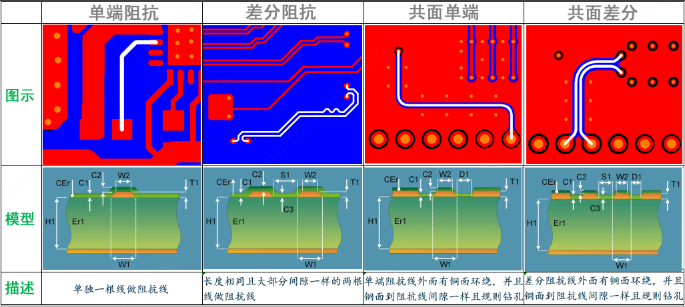
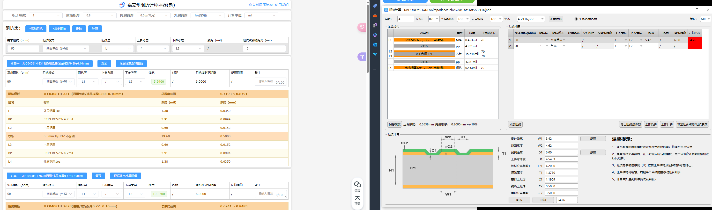
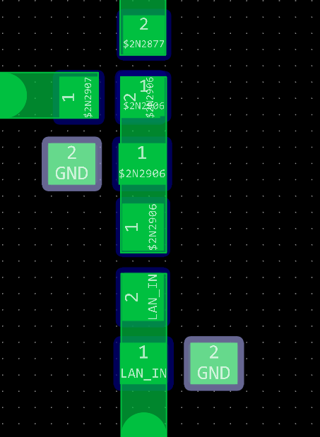

<!--
 * @Author: Ashington ashington258@proton.me
 * @Date: 2024-07-03 13:58:01
 * @LastEditors: Ashington ashington258@proton.me
 * @LastEditTime: 2024-07-04 12:38:26
 * @FilePath: \Hardware_Notes\Impedance_matching\阻抗匹配.md
 * @Description: 请填写简介
 * 联系方式:921488837@qq.com
 * Copyright (c) 2024 by ${git_name_email}, All Rights Reserved. 
-->
# 阻抗匹配

## 产生的原因

>https://www.bilibili.com/video/BV1rP411n7xE/?spm_id_from=333.337.search-card.all.click

## 匹配方式

这里使用多种计算工具相互结合方式计算阻抗匹配

- 嘉立创阻抗计算神器
- 华秋DFM
- SI9000

## 匹配的一般流程

### 1 根据焊盘确定线宽

一般来说，匹配线缆的线宽最好和焊盘宽度保持一致，起码是大于等于，减小反射

### 2 在嘉立创阻抗计算神器中计算阻抗

1. 确定层数
2. 确定厚度

3. 确定阻抗模式
    一般来说我们会先选择外层单端阻抗，此时顶层不铺铜或阻抗线离共面底较远(至少大于参考层的距离)

但是往往此时没有合适的方案，有具体如下的调整方式

- 修改参考层，参考层越远线宽越大(注意，跨层参考中甲铺铜需挖空，挖空最小距离根据勾股定理简单得出)
  - 参考层越远，线宽越大
- 增加共面参考曾，并且修改共面参考地的距离
  - 共面参考地越远，线宽越大，且太远(大于参考曾距离)影响忽略不计，因此往往先确定参考层

根据规律和经验参考面往往是距离最近的影响越大，要想没有影响可以增加距离例如挖空铺铜层和共面地