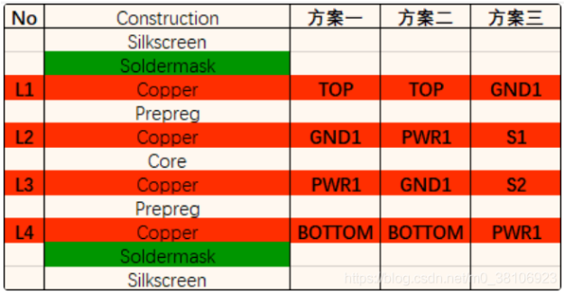
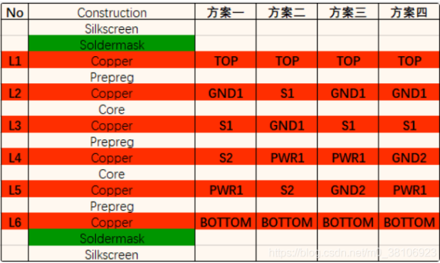
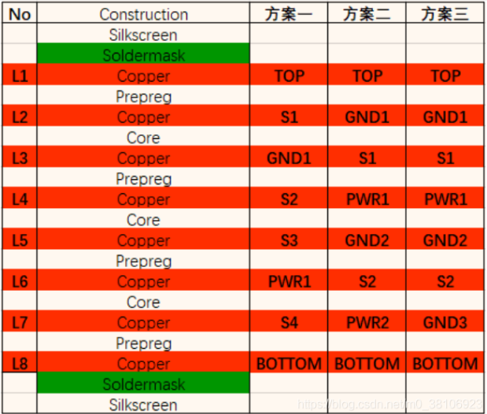

# 多层PCB设计

## 叠层顺序设计

### 1 四层PCB叠层参考

优先选择方案一，外层很多大厂设计不再做敷铜处理。

注意可以使用pullback等内缩内电层，遵循20H原则

### 2 六层PCB叠层方案

方案一：在一些对电源阻抗要求低的情况可以备用，因为其地平面较少所以其电磁吸收能力也是比较差的，需要注意。

方案二：是从方案三叠层方式演变而来的，相比较于方案一由于增加的参考地平面，具有较好的电磁吸收能力，也就是较好的EMI特性，同时也给各层信号设计阻抗带来的便利，也就是说信号层的阻抗具有很好的可控性。

方案三：是最佳方案，由于设计了多层参考地平面，使得叠层具有非常好的电磁吸收能力，其各方面性能也是优于方案二，但是同时信号层的减少，面对高密度线路的时候，考验了layout人员规划布线的能力了。

### 3 八层PCB叠层方案

8层板优选叠层方案主要有三类：

方案一：在一些对电源阻抗要求低的情况可以备用，因为其地平面较少所以其电磁吸收能力也是比较差的，需要注意。

方案二：是从方案三叠层方式演变而来的，相比较于方案一由于增加的参考地平面，具有较好的电磁吸收能力，也就是较好的EMI特性，同时也给各层信号设计阻抗带来的便利，也就是说信号层的阻抗具有很好的可控性。

方案三：是最佳方案，由于设计了多层参考地平面，使得叠层具有非常好的电磁吸收能力，其各方面性能也是优于方案二，但是同时信号层的减少，面对高密度线路的时候，考验了layout人员规划布线的能力了。

>[参考](https://blog.csdn.net/m0_38106923/article/details/106756020)