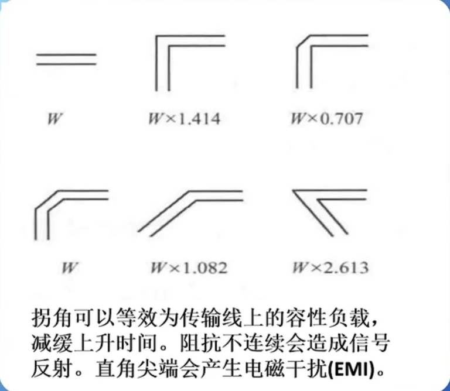
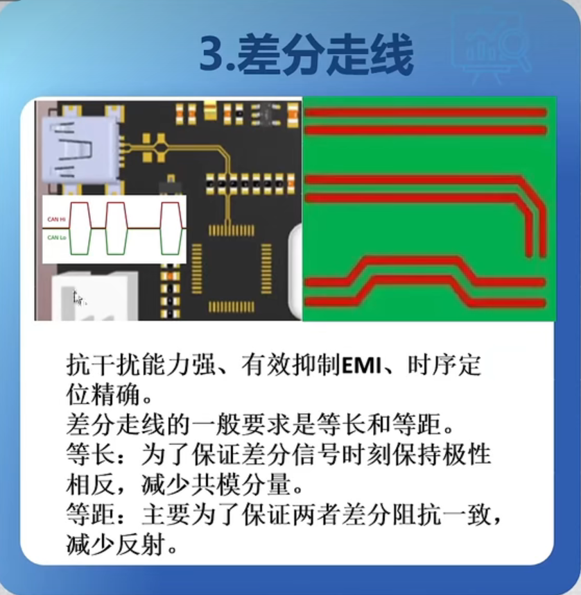
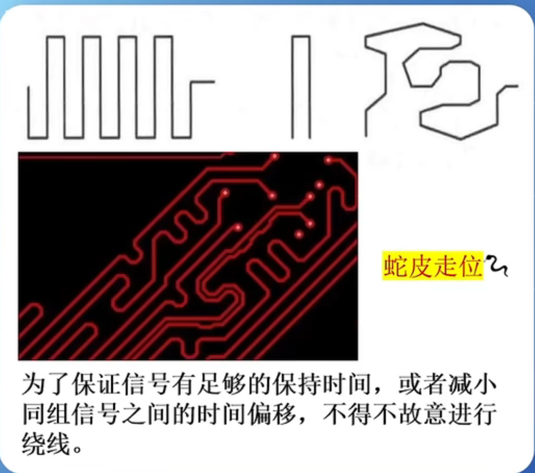
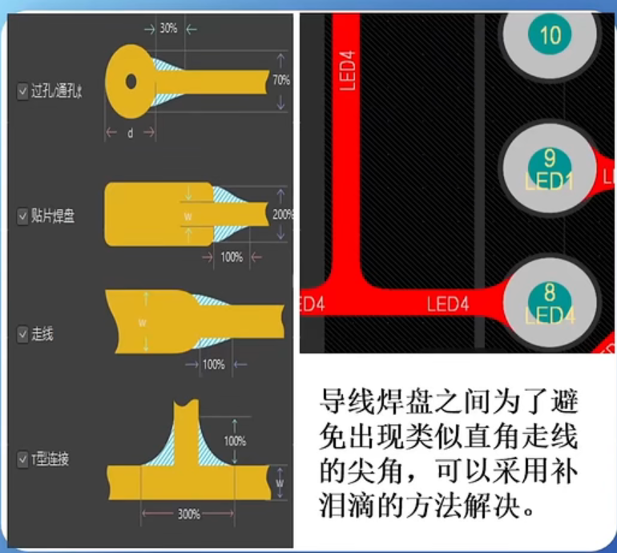
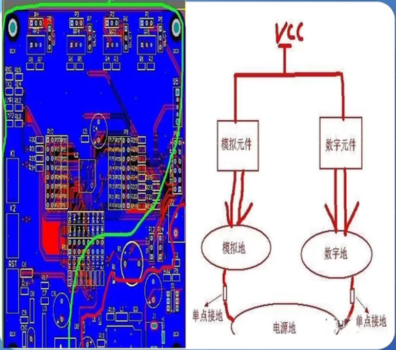
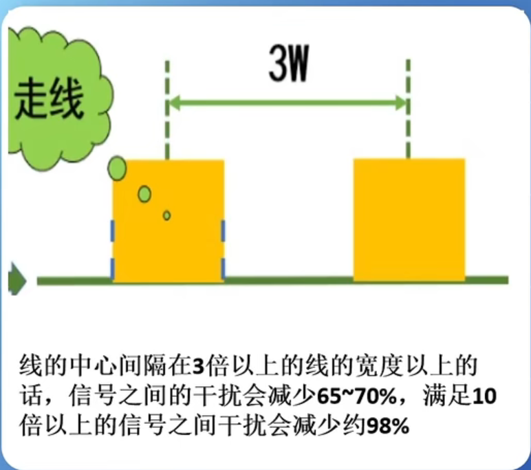
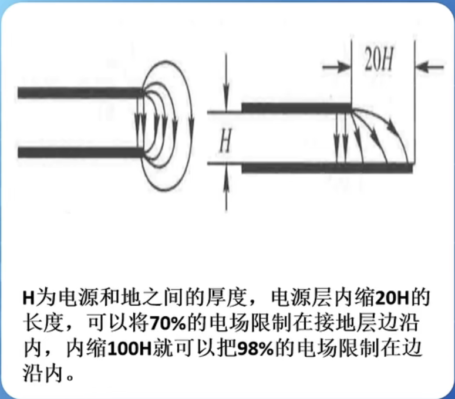
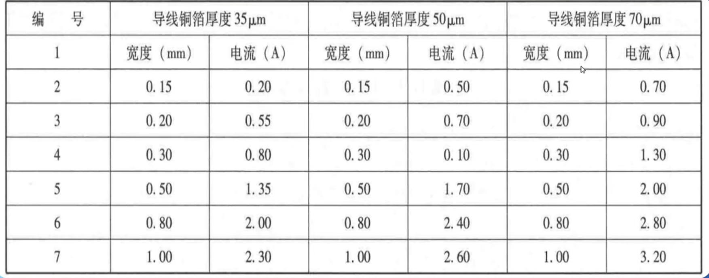
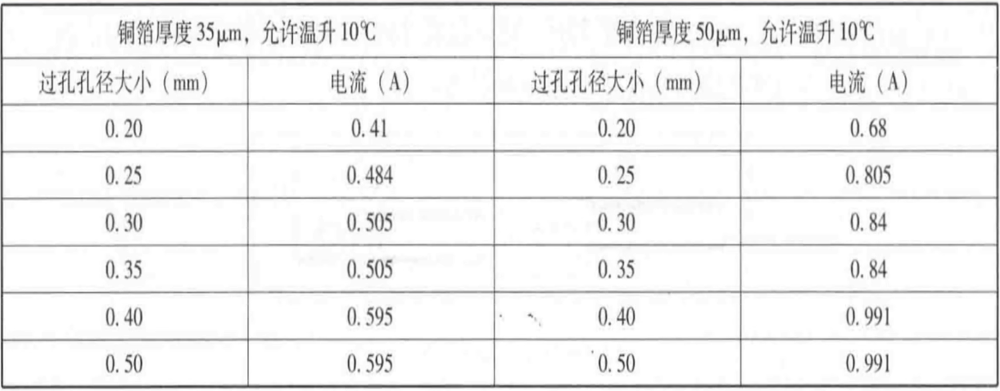

# 布线规则

## 1 电气连接原则

### 1.1 连线精简

尽量选择同层最短路径，不拐弯，不换层
拐弯造成的阻抗变换以及尖端电磁干扰

### 1.2 避免直角布线

### 1.3 差分走线

### 1.4 蛇形线等长

时序相同

### 1.5 圆滑走线

### 1.6 数字模拟分开

### 1.7 3W原则

高速信号之间的串扰可以增加线距来解决

### 1.8 20H原则

## 2 安全载流原则

### 2.1 铜箔承载电流

### 2.2 过孔承载电流

